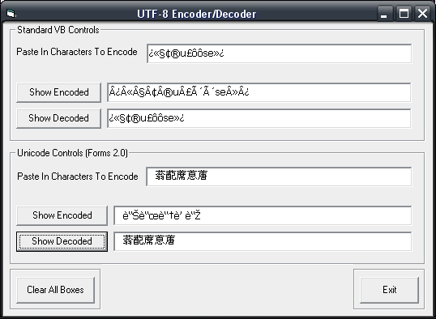

<div align="center">

## UTF\-8 Encoder/Decoder


</div>

### Description

Encodes/Decodes text with a given codepage such as UTF-8/UTF-7 etc. Can be easily altered to be used in some notepad application.
 
### More Info
 


<span>             |<span>
---                |---
**Submitted On**   |2003-04-07 14:33:04
**By**             |[Divide By Zero™](https://github.com/Planet-Source-Code/PSCIndex/blob/master/ByAuthor/divide-by-zero.md)
**Level**          |Beginner
**User Rating**    |4.7 (103 globes from 22 users)
**Compatibility**  |VB 6\.0
**Category**       |[Miscellaneous](https://github.com/Planet-Source-Code/PSCIndex/blob/master/ByCategory/miscellaneous__1-1.md)
**World**          |[Visual Basic](https://github.com/Planet-Source-Code/PSCIndex/blob/master/ByWorld/visual-basic.md)
**Archive File**   |[UTF\-8\_Enco157037472003\.zip](https://github.com/Planet-Source-Code/divide-by-zero-utf-8-encoder-decoder__1-44569/archive/master.zip)

### API Declarations

```
Private Declare Function GetACP Lib "Kernel32" () As Long
Private Declare Function GetLocaleInfoA Lib "Kernel32" (ByVal Locale As Long, ByVal LCType As Long, ByVal lpLCData As String, ByVal cchData As Long) As Long
Private Declare Function GetSystemDefaultLCID Lib "Kernel32" () As Long
Private Declare Function IsWindowUnicode Lib "user32" (ByVal hwnd As Long) As Long
Private Declare Function TranslateCharsetInfo Lib "gdi32" (lpSrc As Long, lpcs As CHARSETINFO, ByVal dwFlags As Long) As Long
Private Declare Function MultiByteToWideChar Lib "Kernel32" (ByVal CodePage As Long, ByVal dwFlags As Long, ByVal lpMultiByteStr As Long, ByVal cchMultiByte As Long, ByVal lpWideCharStr As Long, ByVal cchWideChar As Long) As Long
Private Declare Function WideCharToMultiByte Lib "Kernel32" (ByVal CodePage As Long, ByVal dwFlags As Long, ByVal lpWideCharStr As Long, ByVal cchWideChar As Long, ByVal lpMultiByteStr As Long, ByVal cchMultiByte As Long, ByVal lpDefaultChar As Long, lpUsedDefaultChar As Long) As Long
Private Declare Function MsoCpgFromLid Lib "c:\program files\common files\microsoft shared\vba\mso97rt.dll" Alias "#307" (ByVal lid As Long) As Long
Private Declare Function MsoMultiByteToWideChar Lib "c:\program files\common files\microsoft shared\vba\mso97rt.dll" Alias "#778" (ByVal CodePage As Long, ByVal dwFlags As Long, ByVal lpMultiByteStr As Long, ByVal cchMultiByte As Long, ByVal lpWideCharStr As Long, ByVal cchWideChar As Long) As Long
Private Declare Function MsoWideCharToMultiByte Lib "c:\program files\common files\microsoft shared\vba\mso97rt.dll" Alias "#915" (ByVal CodePage As Long, ByVal dwFlags As Long, ByVal lpWideCharStr As Long, ByVal cchWideChar As Long, ByVal lpMultiByteStr As Long, ByVal cchMultiByte As Long, ByVal lpDefaultChar As Long, lpUsedDefaultChar As Long) As Long
```


